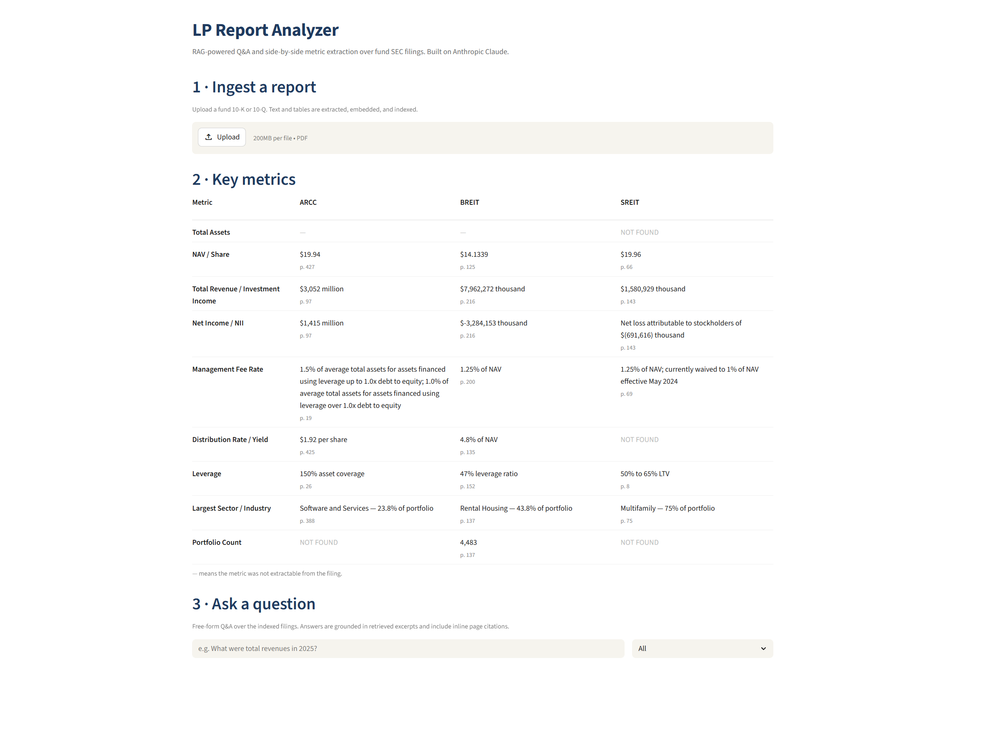

# LP Report Analyzer



A Streamlit app that reads SEC fund filings (10-Ks and 10-Qs), extracts canonical metrics into a side-by-side comparison dashboard, and lets you chat with the documents in plain English. Every answer cites the page it came from.

Built to demonstrate production RAG engineering — not just chunking and embedding, but the layered fixes required to make retrieval actually work over financial filings.

> **Status:** Working pipeline with BREIT and ARCC FY 2025 10-Ks indexed. 7 of 9 canonical metrics extract reliably. Free-form Q&A is fully cited. Cross-fund comparisons work on the structured-extraction layer. Live deploy pending.

---

## Why this project

Most "RAG over PDFs" tutorials end at "upload a doc, ask questions." That works when the document is short and the questions are vague. Real fund filings break it immediately:

- A 10-K is 200+ pages, mostly tables, with critical numbers buried in dense financial-statement schedules.
- Asking "how many industrial properties does BREIT own?" looks simple but requires the system to find the right table on page 137 — out of dozens of tables that mention "industrial" in different contexts.
- Asking "compare BREIT and ARCC's distribution rate" looks like a single question but fails because the two docs don't use the same vocabulary (REITs say "distribution rate," BDCs say "dividend yield").

This project takes those failure modes seriously, fixes each one, and documents what worked and what didn't.

---

## What it does

1. **Ingest.** Upload a fund 10-K or 10-Q. The app extracts text *and* structured tables per page, chunks them with table-aware logic, embeds the chunks, and persists to a local Chroma vector store.
2. **Auto-extract metrics.** On ingest, a fixed set of nine canonical metrics — total assets, NAV per share, revenue, net income, management fee, distribution rate, leverage, largest sector, portfolio count — gets extracted via Claude and cached as JSON.
3. **Dashboard.** A side-by-side comparison table renders metrics for every indexed fund, with inline page citations.
4. **Cited Q&A.** Free-form questions hit a hybrid retrieval pipeline (vector + table-only pass, per-doc split for cross-fund queries) and Claude answers from the retrieved excerpts with `[BREIT p. 137]`-style citations.

---

## The interesting engineering

Naive RAG over financial filings fails in specific, fixable ways. Each layer below was a real failure during development; the fix is what shipped.

### Layer 1 — pdfplumber flattens tables into prose

`pdfplumber.extract_text()` collapses multi-column tables into a single text stream. The portfolio summary table on BREIT's page 137 came out as `Industrial2, 940, 398, 315sq. ft.` — Claude read "Industrial 2" as the property count and picked the wrong sector.

**Fix:** Use `pdfplumber.extract_tables()` separately and render each table as a clean markdown pipe table. Tables become their own chunks, marked with a `[TABLE from page N]` header.

### Layer 2 — markdown tables embed poorly against natural-language questions

Even with clean structure, a chunk of pipe-separated numbers doesn't embed close to a question like "what is the largest sector by property count?" The query embedding is dominated by natural language; the table chunk is dominated by digits and pipes.

**Fix:** For each table, scan the surrounding page text for an introducing phrase ("the following table provides a summary of our portfolio by property sector...") and prepend it as a caption. The caption gives the chunk natural-language anchors that match how questions are phrased.

### Layer 3 — captions miss row-specific queries

The caption matches generic queries about portfolio summaries. But a question like "how many *industrial* properties" doesn't match the caption — it needs the specific sector name to be in the chunk's embedding signal.

**Fix:** Extract the first-column values from each table (sector names, company names, etc.) and prepend them as a `Row labels:` line. Now the chunk embeds with both its high-level framing and its specific row keys.

### Layer 4 — prose chunks still outrank table chunks for any popular keyword

A 10-K mentions "industrial" in narrative hundreds of times — risk factors, tenant descriptions, market commentary. The single table chunk on page 137, even with a caption and row labels, gets buried at rank 16+ in vector retrieval against the dozens of prose chunks discussing "industrial" in any context.

**Fix:** Hybrid retrieval. For every query, run two vector searches: one unrestricted (top 10), one restricted to chunks where the document text contains `[TABLE` (top 5). Merge the results, dedupe. Guarantees a semantically relevant table makes it into the context window even if prose dominates the unrestricted ranking.

### Layer 5 — cross-doc comparisons fail because vocabularies diverge

REIT filings use "distribution rate" and "loan-to-value." BDC filings use "dividend yield" and "asset coverage ratio." The same economic concept, different words. Pure vector search for "distribution rate" surfaces every relevant chunk in BREIT and zero relevant chunks in ARCC. The result: half-comparisons that explicitly note "ARCC excerpts do not contain distribution rate data."

**This is the moment the architecture has to shift.** Comparisons aren't a retrieval problem — they're a vocabulary problem that gets *worse* as you add more docs. The real fix is a separate, structured-extraction layer that runs once per doc at ingest:

- A fixed list of nine canonical metrics, each with a Claude-tuned extraction prompt that handles REIT-vs-BDC vocabulary explicitly.
- Each extraction returns `{value, page, raw}` and is cached as JSON next to the vector store.
- The dashboard reads the cached JSON, not the vector store. Cross-fund comparisons become trivial dictionary joins.

Free-form Q&A still uses RAG. Comparisons use the structured layer. Two architectures, two jobs they're each good at.

---

## Architecture

```
┌────────────────┐
│  PDF upload    │
└───────┬────────┘
        │
        ▼
┌──────────────────────────────────────┐
│  pdfplumber                          │
│  ├─ extract_text() per page          │
│  └─ extract_tables() per page        │
└───────┬──────────────────────────────┘
        │
        ▼
┌──────────────────────────────────────┐
│  Chunking                            │
│  ├─ Prose: recursive char splitter   │
│  └─ Tables: 1 chunk each, with       │
│     caption + row labels prepended   │
└───────┬──────────────────────────────┘
        │
        ▼
┌──────────────────────────────────────┐
│  sentence-transformers               │
│  all-MiniLM-L6-v2 → 384-dim vectors  │
└───────┬──────────────────────────────┘
        │
        ▼
┌─────────────────┐    ┌─────────────────────────┐
│  Chroma store   │    │  Canonical metrics      │
│  (persisted)    │    │  extraction (Claude)    │
│                 │    │  → metrics_<doc>.json   │
└────────┬────────┘    └─────────────┬───────────┘
         │                           │
         ▼                           ▼
┌────────────────────┐    ┌────────────────────────┐
│  Hybrid retrieval  │    │  Dashboard render      │
│  ├─ Unrestricted   │    │  Side-by-side fund     │
│  └─ [TABLE only    │    │  comparison table      │
│     Per-doc split  │    │                        │
│     when no filter │    │                        │
└────────┬───────────┘    └────────────────────────┘
         │
         ▼
┌────────────────────┐
│  Claude haiku-4.5  │
│  Cited answer      │
└────────────────────┘
```

---

## Stack

- **Frontend:** Streamlit
- **PDF extraction:** pdfplumber (text + tables)
- **Chunking:** LangChain `RecursiveCharacterTextSplitter` for prose, custom logic for tables
- **Embeddings:** `sentence-transformers/all-MiniLM-L6-v2` (local, ~400MB, 384-dim)
- **Vector store:** Chroma (file-based, persists to `.chroma/`)
- **LLM:** Anthropic Claude (`claude-haiku-4-5-20251001`)

---

## Run locally

```bash
git clone https://github.com/lgisonda/lp-report-analyzer.git
cd lp-report-analyzer
python -m pip install -r requirements.txt
```

Add your Anthropic API key to `.streamlit/secrets.toml`:

```toml
ANTHROPIC_API_KEY = "sk-ant-..."
```

Run:

```bash
python -m streamlit run app.py
```

Upload a fund 10-K from SEC EDGAR (BREIT, ARCC, SREIT, or any non-traded REIT / BDC). First-time ingest takes ~2 minutes per filing — most of it is metric extraction (9 metrics × ~3 seconds per Claude call).

---

## Known limitations

This pipeline ships honestly. The things that don't work yet:

- **Total Assets and Portfolio Count for BDCs.** The canonical metric extraction sometimes returns NOT FOUND on BDC filings because the relevant numbers live on financial-statement pages that don't embed well against natural-language questions. The current behavior is to refuse rather than guess; fixing it cleanly requires structure-aware extraction (target the financial statements section by document structure rather than retrieval), which is a separate feature.
- **Cross-fund vocabulary mismatch.** The structured-extraction layer handles this for the nine canonical metrics. Free-form cross-fund questions ("compare X and Y across all funds") still partially work via the per-doc retrieval split, but vocabulary differences (e.g., REIT "distribution rate" vs BDC "dividend yield") can produce one-sided answers. A future query-rewriting layer would help.
- **OCR.** Scanned PDFs are not supported. Filings must be text-based (which all SEC EDGAR filings are).
- **Streamlit Cloud deployment** of the live demo is in progress.

---

## Roadmap

- **Live deploy** to Streamlit Cloud with frozen `.chroma/` index for cold-start latency.
- **Fund-type detection.** Auto-detect REIT / BDC / PE / hedge fund and apply a per-type canonical metric list. Currently optimized for non-traded REITs and BDCs.
- **Query rewriting** for cross-vocabulary comparisons.
- **Structure-aware extraction** for balance-sheet line items (Total Assets, etc.) that don't surface well in dense retrieval.

---

## Project structure

```
lp-report-analyzer/
├── app.py                        # Streamlit frontend
├── backend/
│   ├── extract.py                # pdfplumber text + tables per page
│   ├── chunk.py                  # Table-aware chunking + caption + row labels
│   ├── embed.py                  # sentence-transformers wrapper
│   ├── store.py                  # Chroma persistence
│   ├── retrieve.py               # Hybrid retrieval, per-doc split
│   ├── chat.py                   # Cited Q&A via Claude
│   └── metrics.py                # Canonical metrics extraction + cache
├── inspect_index.py              # Diagnostic: dump what's in Chroma for a page
├── .streamlit/
│   ├── config.toml               # Custom theme
│   └── secrets.toml              # API key (gitignored)
├── .chroma/                      # Vector store + metrics cache (gitignored)
├── requirements.txt
└── README.md
```
